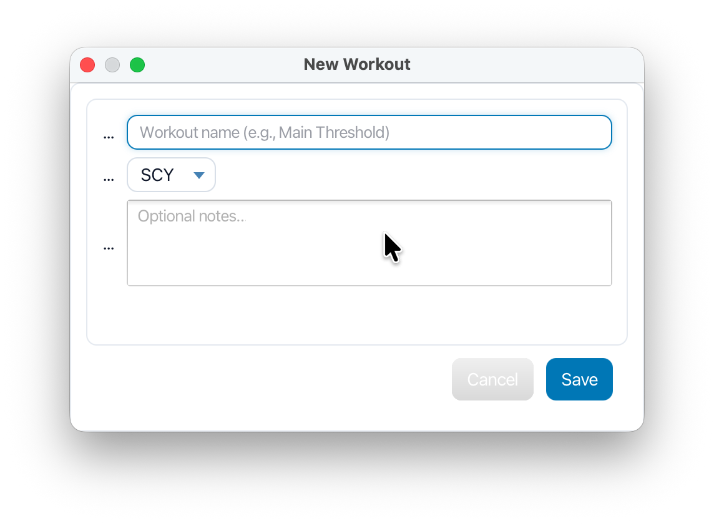

# 🏊 SwimWorkoutBuilder (JavaFX-Only MVP)

A complete **end-to-end JavaFX desktop application** following MVVM architecture principles with observable state, modular presenters, and persistable domain models. The user interface is fully responsive, themeable, and adheres to consistent design conventions.

SwimWorkoutBuilder enables coaches and swimmers to **create structured swim workouts** based on individual seed times. The app computes **goal and interval times** from seed times, stroke type, effort level, equipment, and pool length.

---

## 🧠 Tech Overview
- **Language:** Java 21+ (tested with JDK 24)
- **Framework:** JavaFX 21
- **Build:** Stand-alone (Gradle/Maven not required – IntelliJ run configuration is sufficient)
- **OS:** Built and tested on macOS; should run anywhere JavaFX 21 is available.

---

## ✨ Features (MVP)

### Swimmer Management
- Create, edit, and delete swimmers
- Per-stroke seed times (yards/meters) — editable as seconds or `mm:ss.hh`
- Data persisted locally (no network/database)

### Workout Builder
- Workout header: name, notes, pool length (25y, 25m, 50m)
- Tracks created/updated timestamps, totals (distance, swim/rest, duration)
- Groups contain sets; sets include reps × distance, stroke, effort, equipment, and notes
- Live goal and interval suggestions (policy-based)
- Reorder groups/sets; edit & delete in place
- “Unsaved” chip and Save/Delete actions with clear dirty-state behavior

### Equipment
- Toggle: fins, paddles, kickboard, pull buoy, snorkel, parachute, drag socks
- Equipment icons render directly in builder rows

### Usability / UI
- Clean mac-style **Ocean Depth** theme
- Fixed header while groups/sets panel scrolls
- Bold workout names, italic notes, compact rows for readability

---

## ▶️ How to Run

### Option A — IntelliJ IDEA (recommended)

1. Open the project in IntelliJ IDEA.
2. Ensure **Project SDK** is **Java 21+** (tested with JDK 24).
3. Download **JavaFX 21 SDK** and configure Run/Debug for the app:
    - **Main class:** `swimworkoutbuilder_javafx.Main`
    - **VM options** (adjust paths to your JavaFX SDK):

      ```bash
      --module-path /path/to/javafx-sdk-21/lib
      --add-modules javafx.controls,javafx.fxml
      -Djava.library.path=/path/to/javafx-sdk-21/lib
      ```
4. Click ▶️ **Run**

### Option B — Command Line

```bash
java   --module-path /path/to/javafx-sdk-21/lib   --add-modules javafx.controls,javafx.fxml   -Djava.library.path=/path/to/javafx-sdk-21/lib   -cp out/production/swimworkoutbuilder_javafx:/path/to/javafx-sdk-21/lib/*   swimworkoutbuilder_javafx.Main
```

---

## 🚀 Quick Start (User Flow)

### 1. Create a Swimmer
- Click **New Swimmer**, enter name/team.
- Edit seed times using the ✏️ icon.
    - Enter seconds (`75`) or `mm:ss.hh` (`1:15.20`).
- Switch swimmers via the Swimmer combo in the top bar.

### 2. Create a Workout
- Click **New Workout**.
- In **Current Workout**, edit name/notes (✏️).
- Choose pool length (25y, 25m, 50m).

### 3. Add Groups & Sets
- Click **+ Add Group** → name it (e.g., “Warmup”).
- Within the group, click **+ Set** → fill reps × distance, stroke, effort, equipment, and notes.
- Dialog displays live **Goal** and **Interval** suggestions.

### 4. Save
- When “Unsaved” appears, click **Save** in the workout header.
- Totals update and the chip disappears.

---

## 💾 Data & Persistence

All data is stored locally under:

```
~/.swimworkoutbuilder/
├─ swimmers/
├─ workouts/
└─ last.properties
```

### Developer Utility
A small CLI tool backs up and clears local data:

- **Main class:** `swimworkoutbuilder_javafx.dev.DevTools`
- It creates a ZIP backup under `~/.swimworkoutbuilder_backups/` and removes local data.

---

## 🧱 Project Layout (Selected)

```
swimworkoutbuilder_javafx/
  Main.java
  state/
    AppState.java           # single source of truth (swimmer/workout lists, selection)
    LocalStore.java         # file persistence
  model/
    Swimmer.java
    Workout.java
    SetGroup.java
    SwimSet.java
    enums/ (Course, StrokeType, Effort, Equipment)
    units/ (TimeSpan, Distance)
    pacing/
      PacePolicy.java
      DefaultPacePolicy.java
  ui/
    ActionBar.java
    Theme.java
    Icons.java
    swimmers/
      SwimmerPane.java
    workout/
      WorkoutPane.java
      WorkoutHeaderPane.java
      WorkoutBuilderPane.java
      WorkoutBuilderPresenter.java
      SetFormDialog.java
      SetGroupFormDialog.java
  resources/
    styles-ocean-depth.css
    images/ (equipment PNGs, icons)
  dev/
    DevTools.java
```

---

## ⏱️ Time Formats (MVP)

Input accepts:
- `75` → seconds
- `1:15` → minutes + seconds
- `1:15.20` → minutes + seconds + hundredths

Display: `mm:ss` (no hundredths).

---

## ⚠️ Known Limitations (MVP)

- No printing/export yet (button is placeholder).
- Dialogs center on main screen by default (multi-monitor parenting is a TODO).
- Policy math is basic; future work may add per-distance curves and personal-best imports.

---

## 🧩 Troubleshooting

- **JavaFX path errors:**  
  Ensure `--module-path` points to `<javafx-sdk-21>/lib`  
  and `--add-modules` includes `javafx.controls,javafx.fxml`.

- **“A bound value cannot be set.”**  
  Usually means trying to set a property that’s currently bound.

- **Missing equipment icons:**  
  Confirm `resources/images/*.png` are on the runtime classpath.

---

## 🖼️ Screenshots

### Main UI
<p align="center">
  
  <br>
  <em>Main interface showing swimmer selection and workout builder.</em>
</p>

### Set Dialog
<p align="center">
  
  <br>
  <em>Dialog for entering reps × distance, stroke, effort, and equipment.</em>
</p>

### Workout Dialog
<p align="center">
  
  <br>
  <em>Dialog for entering reps × distance, stroke, effort, and equipment.</em>
</p>

### Full Workout Builder Pane
<p align="center">
  
  <br>
  <em>Dialog for entering reps × distance, stroke, effort, and equipment.</em>
</p>

### Class Diagram (MVP)
<p align="center">
  
  <br>
  <em>Core class relationships for SwimWorkoutBuilder MVP.</em>
</p>

---

## 📜 License

For academic use as part of coursework.

Third-party assets:
- JavaFX (GPL+CE)
- Icon PNGs included under project assets for demo purposes.

---

## 👤 Author

**Parker Blackwell — Fall 2025**  
_SwimWorkoutBuilder (JavaFX-only MVP)_

---

## 🎥 Demo Video

Watch the full demo of **SwimWorkoutBuilder (JavaFX)** in action:

👉 [View Demo on iCloud Drive](https://www.icloud.com/iclouddrive/015z7KKiwqrkLvAD754ECe8Ow#SwimWorkoutBuilder_Demo)
